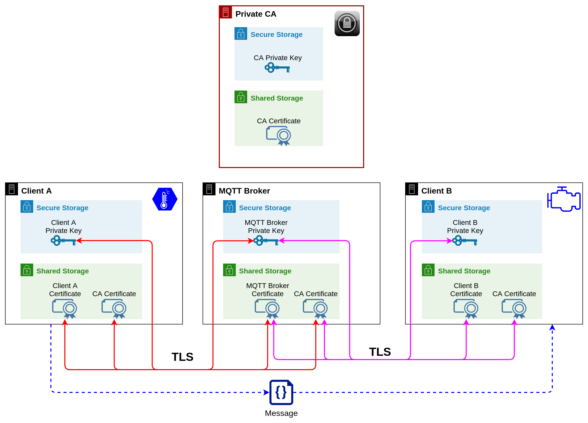
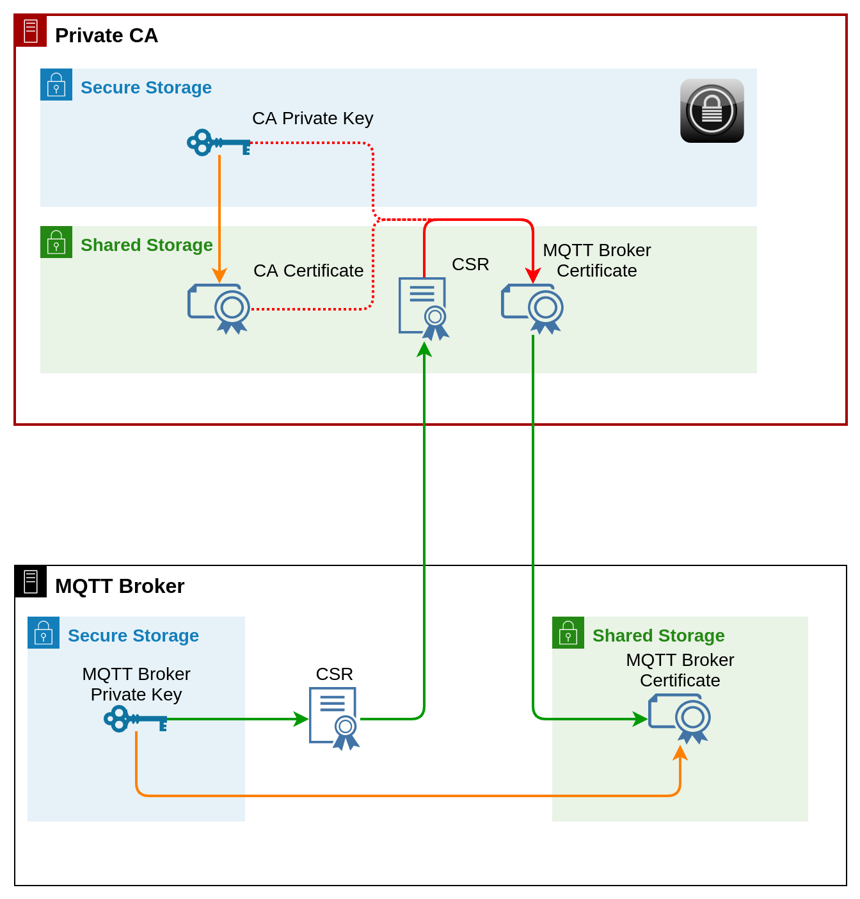
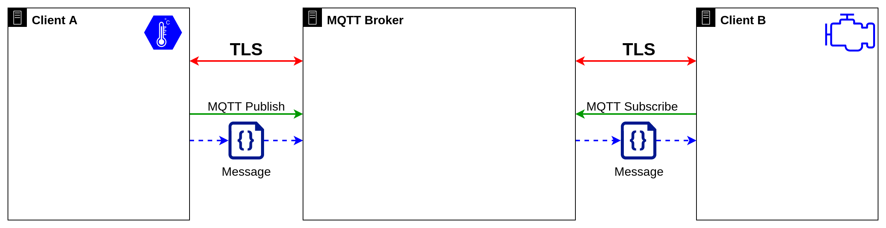

# x509 certificates in IoT - a deep dive

## Overview

This is a deep dive into **x509 certificates** and how they are used in **IoT**.

We are going to build a complete IoT system:
 - two IoT Devices
 - MQTT Broker
 - Private CA

and establish trust between devices:

We will configure the **Private CA** from scratch and use it to sign **x509 certificates** for our devices.

Device **certificates** are used to:
 - confirm **device identity** (this device is the actual devices it claims to be, not some rogue device that tries to access our system)
 - enable **TLS encryption** for communication between devices (so messages can not be read or modified by a potential attacker)

## About tools

I am using **Docker** and **Docker-Compose** to create the environment used in this deep dive but docker knowledge is *not needed* to follow me.

If you want to replicate this setup on your system you need to install those tools. The installation is easy for all systems (Windows, Mac, Linux) and is described in the official documentation:

https://docs.docker.com/get-docker/

https://docs.docker.com/compose/install/

## Let's start

Once you clone or download this repository you need to execute the following command:

`docker-compose up --build`

It will create four containers:

 - my_private_ca
 - mq_broker
 - client_a
 - client_b

These containers are emulating real devices in our system.

Once we have containers running our setup will proceed as follows:

 1. attach to the `my_private_ca` container
    1. generate the Private Key
    2. generate the self-signed CA Certificate
 2. attach to the `mq_broker` container
    1. generate the Private Key
    2. generate the CSR (Certificate Sign Request)
 3. attach to the `my_private_ca` container
    1. sign the CSR from MQTT Broker to create the MQTT Broker certificate
 4. attach to the `mq_broker` container
    1. move the certificate to the proper directory
 5. attach to the `client_a` container
    1. generate the Private Key
    2. generate the CSR
 6. attach to the `client_b` container
    1. check if the Private Key and CSR were created for you (I used a bit of Docker magic here, check the [Dockerfile-client_b](clients/Dockerfile-client_b) for details)
 7. attach to the `my_private_ca` container
    1. sign CSR from Client A to create the certificate for that device
    2. sign CSR from Client B to create the certificate for that device
 8. attach to the `mq_broker` container
    1. start the MQTT sever and leave it running
 9. attach to the `client_a` container
    1. subscribe to the test topic at MQTT Broker
 10. attach to the `client_b` container
     1. publish the MQTT message to the test topic at MQTT Broker       

### Note

The above process looks complex and needs many manual (error-prone) actions. In the real-world solution all of those tasks should be automated.

I decided to use the manual approach in order to guide you through the end-to-end process of system configuration. I hope that it was useful.

Let me know in case of any questions or comments!

https://www.facebook.com/lmtx.iot.7
https://twitter.com/lmtx1
https://t.me/lmtxdev
